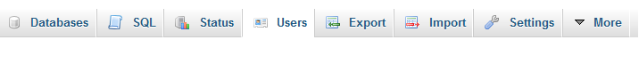
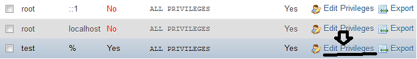
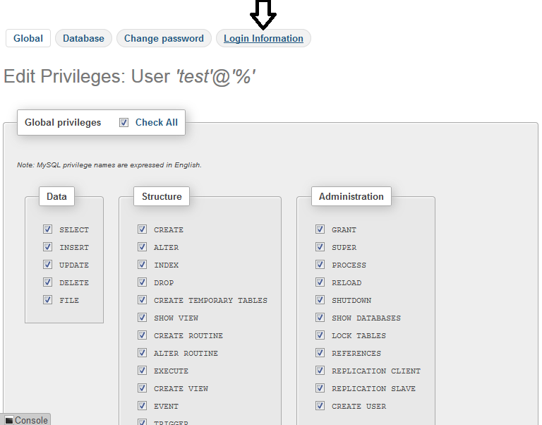
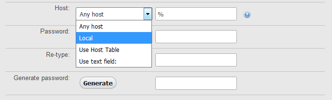
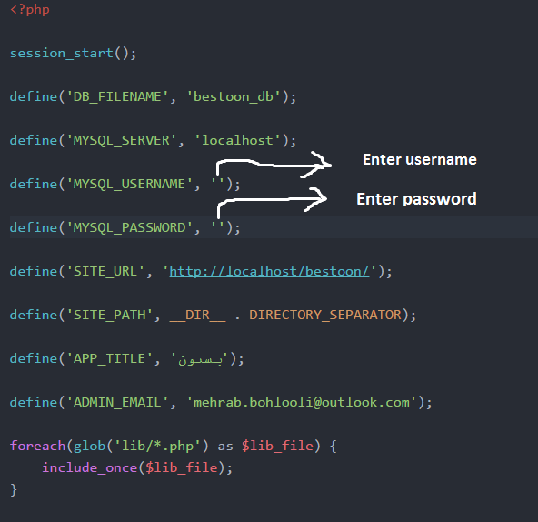

# Bestoon

### A php app for managing your incomes & expenses

[](https://www.mysql.com)

With a default admin user

```

admin username: admin

admin password: admin

```

## How to install:

1. Install [MySQL](https://www.mysql.com/downloads) on your computer

2. Go to _phpMyAdmin_ & create a user with all privileges

3. After creating user go to _users_ page:



4. Select the edit privileges for user that you created:



5. Go to Login Information:



6. Change Host to Local:



7. Click _Go_ button at the end of the page

8. Create a new database named __*bestoon_db*__

9. Go to _Config.php_ & enter your username & password:




## TODO:

- [x] Order incomes & expenses average by date in the chart
- [x] check if email is not unique
- [x] Make a page for visitors(not users)
- [ ] debug the function add_message(lib/modules.php line 60:70)
- [ ] Use ajax in submit_user.php for errors
- [x] Make a user management system for admin
- [ ] Make update system for users, incomes, expenses
- [ ] Save date with standard format in database
